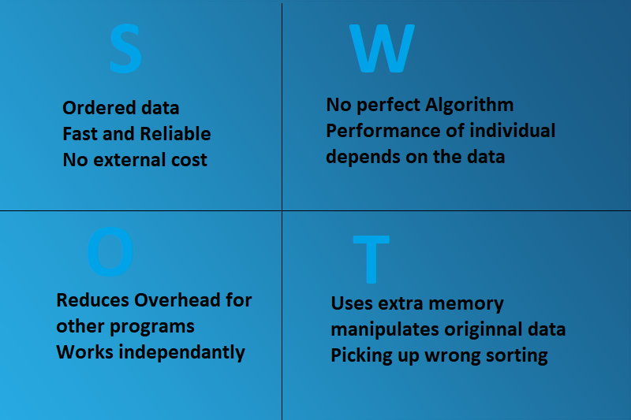

# Requirement

## Introduction

As the Human civilization continued to evolve, the data and the need to search quickly through that data
increased as well. There are so many things in our real life that we need to search for, from a word in
dictionary to a phone number in contact list, from roll in merit list to a record in large dataset. It
all would have been big trouble if data was unordered.
But Human soon realised the need and importance of ordering data and designed different techniques to
order data and now known as Sorting Algorithms.

## Research

### Sorting Algorithms in Data Structures Feature and Benefits

Computer memory is a huge block of  0s and 1s and data is stored in the form of small chunks of this huge
block. when accessing these chunks(data) from memory, searching through the whole memory is neither
feasible as data grows exponetially nor efficient.
So Programmers use sorting algorithm to make searching fast and efficient. 
Sorting does make searching fast and as a result search dependent operation like deletion, insertion,
updation also improves significantly.

### Features

A. 

### Benefits

### Convenience

This Programs allows user to inspect every sorting algorithm and choose the one that suits their needs
best.

### less burden for programmer

This program provides implementation of almost every mainstream sorting algorithm. Thus saving the time
to write it again and again.

## Cost and Feature with Time
Cost |  Feature  |    Time    | 
-------|---------|----------------|
10 |   |   |

## SWOT Analysis

